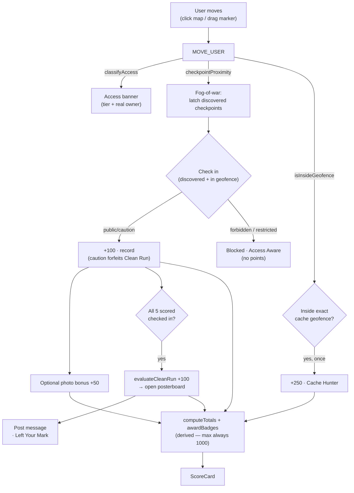

# Architecture

TrailQuest is a **frontend-only** React app. All geospatial reasoning lives in small, pure, unit-tested
modules; the UI is a thin presentational layer over a single `useReducer` state machine. There are **no
runtime network calls** — the real Moab data is fetched once at authoring time and committed static.

## Layers

```text
┌──────────────────────────────────────────────────────────────┐
│ App.tsx                 useReducer(questReducer) + sonner toasts│
│  ├─ MapView             Leaflet: imagery/hillshade, zones,      │
│  │                       trails, route, fog-of-war markers,     │
│  │                       geocache circle, draggable user marker │
│  └─ overlay cards        Briefing · Score · CheckpointPanel ·   │
│                          AccessBanner · PosterboardDialog       │
├──────────────────────────────────────────────────────────────┤
│ state/questReducer.ts   integration seam (geo + scoring + UI)  │
├──────────────────────────────────────────────────────────────┤
│ lib/geo.ts              pure spatial primitives                │
│ lib/scoring.ts          pure scoring + derived badges/totals    │
├──────────────────────────────────────────────────────────────┤
│ data/  (typed fixtures) + data/sources/ (committed real GeoJSON)│
│ types/quest.ts          the domain model                        │
└──────────────────────────────────────────────────────────────┘
        ▲ authored once by scripts/fetch-moab-data.mjs (offline)
```

**Why this shape:** the take-home rewards visible spatial reasoning, so the logic that "is" the product —
distance, point-in-polygon access classification, fog-of-war thresholds, the 1000-point model — is isolated
in `lib/geo.ts` and `lib/scoring.ts` as pure functions with no I/O. They're trivial to test and read. The
reducer is the only place where geo, scoring, and UI state meet, which is where integration bugs would
otherwise hide — so it gets its own test suite.

## The core loop



## Data flow (authoring vs. runtime)

- **Authoring time (`scripts/fetch-moab-data.mjs`, run once):** fetch OSM trails + named features, UGRC
  land ownership (reclassified into access tiers) + trailheads, BLM MTB attributes, and USGS 3DEP
  elevation; snap the quest route to the real trail network via a Turf graph shortest-path; simplify
  geometry; write `src/data/sources/*.geojson` + `checkpoints.authored.json`. Responses are disk-cached.
- **Runtime:** `data/*.ts` import the committed GeoJSON (via Vite `?raw` + `JSON.parse`, inlined into the
  bundle) and wrap it in the typed `Quest` model. The app reads it synchronously — no fetch, no CORS, no keys.

## Key invariants (enforced by tests)

- Geofence boundary is **inclusive** (`distance <= radius`).
- Access tier uses **most-restrictive precedence** (`restricted > caution > public`); a point outside all
  polygons is `public`.
- All scored bonuses are **idempotent**; `max` score is **always 1000**.
- All 5 scored checkpoints are on **public** land, so a perfect clean run is reachable; the restricted block
  is demonstrated by the unscored Tower Arch waypoint.

## Modules

| Module | Responsibility |
| --- | --- |
| `lib/geo.ts` | `distanceMeters`, `isInsideGeofence`, `classifyAccess`, `checkpointProximity`, `computeGain`, `routeTotals`, `formatLatLon`, `toUTM` |
| `lib/scoring.ts` | `applyCheckIn/PhotoBonus/GeocacheFind`, `evaluateCleanRun`, derived `awardBadges` + `computeTotals` |
| `state/questReducer.ts` | actions (`MOVE_USER`, `CHECK_IN`, `PHOTO_BONUS`, `POST_MESSAGE`, posterboard) + notices → toasts |
| `components/MapView.tsx` | all Leaflet layers + marker rendering + click-to-move |
| `components/*Card.tsx` | floating overlay UI bound to reducer state |
| `data/*.ts` | typed quest, access zones, route, briefing, posterboard, badges |
| `scripts/fetch-moab-data.mjs` | authoring-time real-data pipeline |
